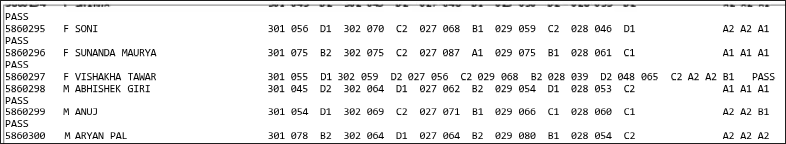

The Project uses python and file handling to first extract data from cbse given txt file and using oops and pickle 
addes the objects into a binary file and then further uses mysql to intiatialize the database and take insights using
sql commands and then creates a docx file and displays the insights in an oranised manner and uses matplotlib to visualize
the data in bar graphs.

The initial file given by cbse looks like this

